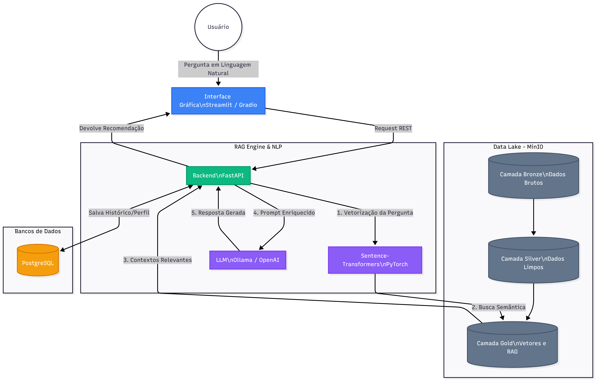

## Grupo 1 - CP901TAN1

- Diogo Confortini De Oliveira - 211898  
- Edgar Moiti Inoki Yabiku - 212176  
- Graziano Aparecido Gonçalves Rodrigues - 211971  
- João Henrique Coelho Nascimento - 222228  
- João Pedro Rodrigues Pinto - 211313  
- Larissa Naomy Otsu - 223382  
- Luís Teixeira de Oliveira Alves - 223624  
- Mayara Lima - 211918  
- Vítor Floriano Shinoda - 222293  
- Gustavo Costa Gomes - 151281  

## Tema - Foods&Restaurants
### Empresa
- FoodHunter

### Dataset (Fonte)
- https://huggingface.co/datasets/JesseFWarrenV/Yelp-Restaurants/viewer/default/train?p=1503
### Project Owner
- Edgar Moiti Inoki Yabiku

# Objetivo do Projeto

O projeto tem como objetivo construir uma plataforma analítica capaz de:

- ingerir grandes volumes de dados de restaurantes
- estruturar dados em arquitetura Medallion
- realizar tratamento e enriquecimento dos dados
- armazenar informações em Data Lake
- treinar modelos de Machine Learning
- comparar algoritmos de classificação
- gerar contexto analítico para sistemas RAG (Retrieval-Augmented Generation)

---

# Contexto de Negócio

A proposta do sistema é atuar como um motor inteligente de recomendação gastronômica, permitindo identificar restaurantes com maior potencial de recomendação com base em:

- avaliações
- quantidade de reviews
- categorias gastronômicas
- delivery
- faixa de preço
- características estruturais

---

# Arquitetura Geral

O projeto foi desenvolvido utilizando arquitetura Medallion dividida em:

```text
Bronze → Silver → Gold → Machine Learning
```

---

# Estrutura do Projeto

```text
RAG-SAPATO/
│
├── 1. bronze/
│   ├── restaurants_with_embeddings.csv
│   ├── bronze.ipynb
│   └── README.md
│
├── 2. silver/
│   ├── silver.py
│   ├── silver.ipynb
│   ├── silver_data.parquet
│   └── README.md
│
├── 3. gold/
│   ├── gold.py
│   ├── gold_data.parquet
│   └── README.md
│
├── 4. Pipeline/
│   ├── pipeline.py
│   ├── Pipeline(Documentação).md
│   └── README.md
│
├── 5. Treino_de_Modelo/
│   ├── train_classification.py
│   ├── train_classification.ipynb
│   └── README.md
│
├── mlruns/
│
├── docker-compose.yaml
├── Dockerfile
├── requirements.txt
├── README.md
└── README_Sprint3.md
```

---

# Tecnologias Utilizadas

## Engenharia de Dados

- Python
- Pandas
- NumPy
- PyArrow
- S3FS

---

## Data Lake

- MinIO
- Docker Compose

---

## Machine Learning

- Scikit-Learn
- MLflow

---

## Visualização

- Matplotlib
- Seaborn

---

## Infraestrutura

- Docker
- PostgreSQL

---

# Sprint 1 — Definição do Produto

## Atividades Realizadas

- definição do domínio do projeto
- definição do problema de negócio
- levantamento de requisitos
- estruturação do fluxo analítico
- planejamento do pipeline de dados

---

## Problema de Negócio

Identificar automaticamente restaurantes potencialmente recomendáveis utilizando dados estruturados e modelos supervisionados de Machine Learning.

---

## Resultado da Sprint

Entrega do Product Backlog inicial e definição da proposta arquitetural do sistema.

---

# Sprint 2 — Arquitetura e Infraestrutura Base

## Objetivos

- definição da arquitetura geral
- desenho arquitetural
- configuração inicial da infraestrutura
- criação do ambiente Docker

---

# Infraestrutura Implementada

## Serviços Containerizados

O projeto utiliza:

- MinIO
- PostgreSQL
- MLflow

---

# Docker Compose

Os serviços foram organizados via:

```text
docker-compose.yaml
```

Responsabilidades:
- subir containers
- gerenciar serviços
- centralizar infraestrutura

---

# MinIO

O MinIO foi utilizado como Data Lake compatível com S3.

Buckets criados:

```text
bronze
silver
gold
```

---

# PostgreSQL

Utilizado como backend do MLflow para rastreamento de experimentos.

---
# Diagrama Arquitetural



# Resultado da Sprint

Entrega de:
- arquitetura funcional
- ambiente Docker operacional
- MinIO integrado
- PostgreSQL operacional
- base do pipeline pronta

---

# Sprint 3 — Governança e Arquitetura Medallion

## Objetivos

- estruturar Bronze / Silver / Gold
- implementar pipeline de ingestão
- versionar dados no MinIO

---

# Arquitetura Medallion

## Camada Bronze

Responsável pelo armazenamento bruto dos dados.

Características:
- dados originais
- sem transformações
- preservação histórica
- auditoria

Formato:
```text
CSV
```

---

## Camada Silver

Responsável pela limpeza e enriquecimento.

Transformações realizadas:
- parsing de dicionários
- conversão de embeddings
- tratamento de listas
- criação de features
- filtragem de restaurantes abertos
- limpeza estrutural

Formato:
```text
Parquet
```

---

## Camada Gold

Responsável pela camada analítica.

Processamentos realizados:
- criação de score analítico
- normalização de métricas
- geração de contexto RAG
- preparação para Machine Learning

Formato:
```text
Parquet
```

---

# Pipeline de Ingestão

O pipeline automatiza:

```text
Bronze
   ↓
Silver
   ↓
Gold
   ↓
MinIO
```

---

# Versionamento no MinIO

Os datasets processados são enviados diretamente ao Data Lake:

```python
s3://bronze/
s3://silver/
s3://gold/
```

---

# Resultado da Sprint

Entrega de:
- pipeline funcional
- camadas estruturadas
- integração com MinIO
- governança básica de dados
- documentação das camadas

---

# Sprint 4 — Modelagem e Treinamento de Modelos

## Objetivos

- definição do problema de ML
- treinamento de modelos
- comparação de algoritmos
- integração com MLflow

---

# Problema de Machine Learning

Tipo:
```text
Classificação Binária
```

Objetivo:
- prever se um restaurante é recomendável

---

# Variável Alvo

```python
is_recommended
```

Critério:

```python
df['stars'] >= 3.5
```

---

# Features Utilizadas

## Features Numéricas

- review_count
- price_range

---

## Features Booleanas

- has_delivery
- has_outdoor

---

## Features Categóricas

Categorias gastronômicas convertidas com:

```python
MultiLabelBinarizer()
```

---

# Modelos Treinados

## Naive Bayes

```python
GaussianNB()
```

---

## Decision Tree

```python
DecisionTreeClassifier()
```

---

## Rede Neural

```python
MLPClassifier()
```

---

## Logistic Regression

```python
LogisticRegression()
```

---

# Métricas Avaliadas

| Métrica | Objetivo |
|---|---|
| Accuracy | Taxa geral de acerto |
| Precision | Precisão das previsões positivas |
| Recall | Sensibilidade |
| F1-Score | Equilíbrio entre precisão e recall |

---

# Matrizes de Confusão

Cada modelo gera:
- matriz de confusão
- visualização gráfica
- análise comparativa

---

# Comparação de Modelos

Os modelos são comparados principalmente via:

```text
F1-Score
```

---

# MLflow

O MLflow foi integrado para:

- rastreamento de experimentos
- organização de execuções
- comparação de modelos
- monitoramento de métricas

Experimento utilizado:

```python
Foodhunter_Classification
```

---

# Fluxo Completo do Sistema

```text
Dataset Bruto
      ↓
Camada Bronze
      ↓
Camada Silver
      ↓
Camada Gold
      ↓
MinIO Data Lake
      ↓
Treinamento ML
      ↓
Avaliação
      ↓
Comparação de Modelos
```

---

# Integração com RAG

A camada Gold gera:

```python
rag_context
```

Objetivo:
- alimentar futuros sistemas RAG
- fornecer contexto textual enriquecido
- facilitar busca semântica

---

# Visualizações Geradas

Durante o processamento e treinamento são gerados:

- mapa de correlação
- distribuição de estrelas
- delivery vs avaliação
- review count vs stars
- matrizes de confusão
- comparação de métricas

---

# Como Executar o Projeto

## 1. Clonar o Repositório

```bash
git clone <repositorio>
```

---

## 2. Criar Ambiente Virtual

```bash
python -m venv .venv
```

---

## 3. Ativar Ambiente

### Windows

```bash
.venv\Scripts\activate
```

---

## 4. Instalar Dependências

```bash
pip install -r requirements.txt
```

---

# Subir Infraestrutura

```bash
docker compose up -d
```

---

# Executar Pipeline

## Silver

```bash
python "2. silver/silver.py"
```

---

## Gold

```bash
python "3. gold/gold.py"
```

---

## Pipeline Completo

```bash
python "4. Pipeline/pipeline.py"
```

---

# Treinar Modelos

```bash
python "5. Treino_de_Modelo/train_classification.py"
```

---

# Buckets Utilizados

| Bucket | Responsabilidade |
|---|---|
| bronze | dados brutos |
| silver | dados limpos |
| gold | dados analíticos |

---

# Características do Projeto

| Funcionalidade | Status |
|---|---|
| Arquitetura Medallion | Sim |
| Data Lake | Sim |
| MinIO | Sim |
| Docker | Sim |
| Pipeline ETL | Sim |
| Machine Learning | Sim |
| MLflow | Sim |
| Visualizações | Sim |
| Engenharia de Features | Sim |
| Integração RAG | Sim |

---

# Resultados Obtidos

O projeto conseguiu:

- estruturar pipeline analítico completo
- implementar Data Lake funcional
- automatizar processamento de dados
- treinar múltiplos modelos supervisionados
- comparar desempenho entre algoritmos
- gerar contexto para aplicações RAG
- integrar monitoramento com MLflow

---

# Próximos Passos

Evoluções futuras planejadas:

- API de recomendação
- integração com LLMs
- busca vetorial
- embeddings semânticos avançados
- dashboard analítico
- deploy em nuvem
- monitoramento de drift
- feature store
- orquestração com Airflow

